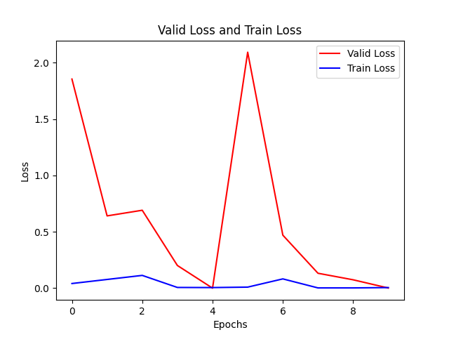
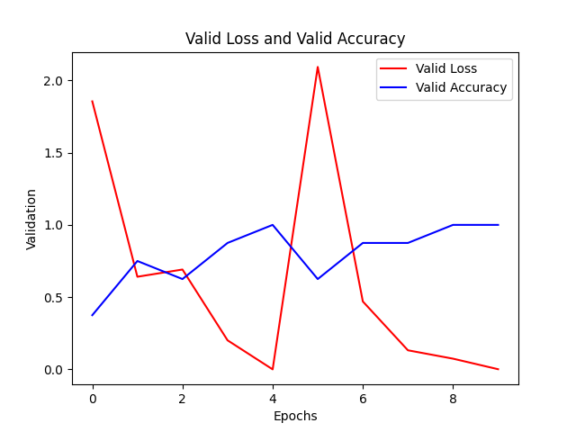

Detección de Naranjas en buen y mal estado
======

# Version de python

Python 3.9

# Instalación del entorno

```bash

virtualenv --python=python3.9 venv

source venv/bin/activate

pip install -r requirements.txt

```

[PyTorch](https://www.gcptutorials.com/post/how-to-install-pytorch-with-pip)


# Entrenar

```bash

python training

```







# Probar

```bash

python testing

```

python testing

python test-camara

# Basado en

https://iqraanwar.medium.com/how-to-detect-rotten-fruits-using-image-processing-python-be2d39abc709

https://github.com/IqraBaluch/Detection-of-Rotten-Fruits-DRF-Using-Image-Processing-Python


# Automatic classification of oranges using image processing and data mining techniques (Argentina)
https://core.ac.uk/download/pdf/296347784.pdf

# An extensive dataset for successful recognition of fresh and rotten fruits

https://www.sciencedirect.com/science/article/pii/S2352340922007594

# Fresh and Rotten Fruits Dataset for Machine-Based Evaluation of Fruit Quality (DATASET)

https://data.mendeley.com/datasets/bdd69gyhv8/1

https://data.mendeley.com/public-files/datasets/bdd69gyhv8/files/ccd1f142-03b2-473a-8c78-78920e63b8bd/file_downloaded


# Redimensionar imagenes


```bash

find . -maxdepth 1 -iname "*.jpg" | xargs -L1 -I{} convert -resize 500x500 "{}" resize/"{}"

```